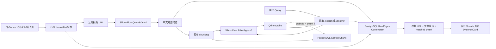

# FlyForum 视频 RAG Demo 设计规格

## 1. 目标

在现有 Intelligence RAG 项目中，用最少代码和最小文件改动打通一条可演示的视频 RAG 链路：

1. 从 `https://www.flyforum.cn/forum.php` 及其公开论坛/帖子页面发现直接可访问的视频 URL；
2. 将视频 URL 发送给硅基流动 Qwen3-Omni 模型生成中文描述；
3. 将视频 URL、来源页面和完整描述保存到 PostgreSQL；
4. 将描述分 chunk，并使用硅基流动 `BAAI/bge-m3` 生成向量写入 Qdrant；
5. 建立 PostgreSQL chunk 与 Qdrant point 的一一对应关系；
6. 用户查询时先按 Qdrant 相似度命中 chunk，再从 PostgreSQL 返回对应视频 URL、完整描述、匹配片段和分数；
7. 在现有前端 Search 页面展示视频播放器和检索证据。

本功能只要求流程跑通，不建设生产级通用视频采集平台。

## 2. 设计原则

- **最小改动：** 复用现有表、检索接口和前端 EvidenceCard，不新增服务或页面。
- **PostgreSQL 为事实源：** Qdrant 只保存向量及关联 payload，完整描述始终从 PostgreSQL 返回。
- **一套 embedding：** 入库和查询必须使用相同的 SiliconFlow `BAAI/bge-m3` 配置。
- **有界 demo：** 默认最多抓取 3 个页面、分析 1 个视频，请求间隔不少于 1 秒。
- **公开数据：** 只访问无需登录的公开页面，不绕过验证码、反爬、权限或速率限制。
- **凭据隔离：** API key 只从环境变量读取，任何日志、事件和 JSON 输出都不得包含凭据。
- **失败可见：** 单个页面、VLM 或 Qdrant 失败不隐藏；run 必须以 `partial` 或 `failed` 反映状态。

## 3. 方案选择

### 3.1 方案 A：扩展现有通用 worker

把 Discuz 页面发现、视频抽取、VLM 分析和向量写入全部接入 `worker/app/runner.py`。

优点是长期结构统一，后续可复用调度、事件和重试机制。缺点是需要改动 adapter、normalizer、runner、配置模型和大量测试，明显超过“只做流程跑通”的 demo 范围。

### 3.2 方案 B：新增 `video_assets` 等专用表

为视频资产、发现历史和分析状态建立独立数据模型。

优点是语义清晰，适合生产化管理重复发现、重新分析和媒体状态。缺点是需要 Alembic migration、repository/API/schema 以及额外前端页面，改动面最大。

### 3.3 方案 C：独立 demo 导入脚本，复用现有内容表

新增一个有界导入脚本，把视频描述保存为现有 `ContentItem`，再复用 `ContentChunk`、Qdrant 和 `/search`。

这是本规格采用的方案。它无需数据库迁移，能复用现有 raw snapshot、run、chunk、retrieval 和 evidence 链路，也最符合“最简代码、最小改动”的要求。

## 4. 系统边界

### 4.1 支持范围

- 起始地址默认为 `https://www.flyforum.cn/forum.php`；
- 页面抓取仅限 `www.flyforum.cn` 的 HTTPS 论坛页和帖子页；
- 支持 HTML 中直接出现的：
  - `<video src>`；
  - `<video><source src>`；
  - 指向 `.mp4`、`.webm` 或 `.m3u8` 的普通链接；
- 支持相对 URL 解析、fragment 移除和稳定去重；
- 视频可位于公开 CDN 域名，因为应用不下载视频，只把 URL 交给 VLM；
- VLM 生成 300 至 800 字中文描述，覆盖场景、主体、动作和关键细节；
- Qdrant 使用独立 collection `flyforum_video_bge_m3`，避免与旧的 deterministic 384 维 collection 混用。

### 4.2 非目标

- 登录 FlyForum 或处理验证码；
- 绕过 robots、反爬或访问控制；
- 执行网页 JavaScript；
- 逆向播放器、解析隐藏流地址或抓取第三方受保护视频；
- 下载视频、下载 HLS segments、调用 FFmpeg/FFprobe；
- 定时任务、全站爬取、分布式并发或重试队列；
- 新增视频资产表、数据库迁移、Videos 页面或独立视频 API；
- 为历史 deterministic collection 自动重建向量。

## 5. 总体架构

系统仍为现有模块化单体。新增脚本承担 demo 采集编排；FastAPI 继续承担查询；React 前端继续消费现有 Evidence contract。

## 6. 组件设计

### 6.1 SiliconFlow embedding provider

在现有 embedding service 中增加 `SiliconFlowEmbeddingService`，通过 OpenAI-compatible `/embeddings` 接口调用 `BAAI/bge-m3`。

配置项：

| 环境变量 | 默认值 | 用途 |
|---|---|---|
| `EMBEDDING_PROVIDER` | `fake` | `siliconflow` 时启用远程 embedding |
| `SILICONFLOW_API_KEY` | 无 | VLM 与 embedding 共用的本地密钥 |
| `SILICONFLOW_BASE_URL` | `https://api.siliconflow.cn/v1` | API base URL |
| `EMBEDDING_MODEL` | `BAAI/bge-m3` | 向量模型 |
| `EMBEDDING_DIMENSION` | `1024` | Qdrant collection 向量维度 |
| `VLM_MODEL` | `Qwen/Qwen3-Omni-30B-A3B-Instruct` | 视频描述模型 |
| `QDRANT_COLLECTION` | 现有默认值 | demo 运行时显式设置为 `flyforum_video_bge_m3` |

`build_embedding_service(settings)` 是唯一默认构造入口。导入脚本和 `SearchService` 都使用该工厂，避免写入使用 BGE-M3、查询仍使用 deterministic embedding 的错误。

`EMBEDDING_PROVIDER=fake` 继续作为测试默认值，现有测试不访问外网。

### 6.2 FlyForum demo 导入脚本

新增 `scripts/ingest_flyforum_video_demo.py`，职责限制为：

1. 验证 CLI 上限和必要环境变量；
2. 创建或复用 demo-owned Source/Job；
3. 创建 CrawlRun；
4. 有界遍历论坛/帖子页面；
5. 先保存 RawPage，再抽取视频 URL；
6. 对未导入的视频调用 VLM；
7. 创建 ContentItem 和 chunks；
8. 提交 PostgreSQL 后写入 Qdrant；
9. 回写 chunk vector 状态并结束 run；
10. 输出不含凭据的摘要 JSON。

脚本参数：

| 参数 | 默认值 | 约束 |
|---|---|---|
| `--start-url` | `https://www.flyforum.cn/forum.php` | 必须是允许的 FlyForum HTTPS 页面 |
| `--page-limit` | `3` | 必须大于等于 1 |
| `--video-limit` | `1` | 必须大于等于 1 |
| `--request-delay` | `1.0` | 不得小于 1 秒 |
| `--json` | false | 输出结构化运行摘要 |

页面解析使用标准库 `html.parser.HTMLParser`，不新增 BeautifulSoup 依赖。待访问页面必须满足以下任一模式：

- `forum.php`；
- 路径包含 `forum-`；
- 路径包含 `thread-`；
- query 中 `mod=viewthread`。

视频 URL 必须使用 HTTP(S)、不含嵌入式用户名或密码，并且解析后的 path 以 `.mp4`、`.webm` 或 `.m3u8` 结尾。fragment 在去重前移除。

### 6.3 VLM 描述

脚本调用 SiliconFlow `/chat/completions`，发送一个文本 part 和一个 `video_url` part。文本要求模型使用中文描述场景、主体、动作和关键细节，目标长度为 300 至 800 字。

响应必须满足：

- HTTP 请求成功；
- `choices[0].message.content` 存在；
- 去除空白后非空。

本 demo 不做第二次补问、内容结构验证或 HLS 下载 fallback。VLM 拒绝某个 URL 时记录该视频失败并继续处理剩余候选。

### 6.4 PostgreSQL 持久化

不新增表。使用现有模型表示视频内容：

#### SourceSite / CrawlJob / CrawlRun

- SourceSite 标记为 demo-owned，base URL 指向 FlyForum；
- CrawlJob 保存本次固定的页面和视频上限；
- CrawlRun 记录运行状态与现有通用计数。

#### RawPage

每个成功抓取的页面在解析前创建 RawPage：

- `requested_url` 和 `final_url` 记录页面地址；
- `raw_html` 保存原始 HTML；
- `parser_profile = "flyforum_video_demo"`；
- `parse_status` 在抽取成功后为 `parsed`。

#### ContentItem

每个成功生成描述的视频对应一个 ContentItem：

| 字段 | 值 |
|---|---|
| `item_type` | `video_description` |
| `canonical_url` | 规范化视频 URL |
| `source_url` | 发现视频的 FlyForum 页面 |
| `cleaned_text` | 完整 VLM 中文描述 |
| `summary_text` | 描述前 240 字 |
| `language` | `zh` |
| `tags` | `flyforum`, `video` |
| `structured_by` | `qwen3_omni_video_demo` |
| `metadata_json.video_url` | 视频 URL |
| `metadata_json.source_page_url` | 来源页面 URL |
| `metadata_json.vlm_model` | 实际 VLM 模型名 |

`dedup_key` 由 `source.id + item_type + normalized_video_url` 生成，不包含描述文本。同一视频再次被发现时直接计入 `deduped_count` 并跳过 VLM，避免重复费用。

#### ContentChunk

完整描述通过现有 `build_chunks` 分块。新 chunk 初始为：

- `embed_status = "pending"`；
- `vector_backend = null`；
- `vector_point_id = null`；
- `qdrant_point_id = null`。

chunks 必须先提交 PostgreSQL，之后才能调用 embedding 和 Qdrant。

### 6.5 Qdrant 写入与关联

每个 ContentChunk 对应一个 Qdrant point：

| PostgreSQL | Qdrant | 关系 |
|---|---|---|
| `content_chunks.id` | point ID | 值完全相同 |
| `content_chunks.id` | payload `chunk_id` | 值完全相同 |
| `content_items.id` | payload `content_item_id` | 用于回查全文 |
| `content_items.canonical_url` | payload `video_url` | 用于筛选和诊断 |
| `content_items.source_url` | payload `source_page_url` | 保留来源 |
| `content_items.item_type` | payload `item_type` | 值为 `video_description` |

Qdrant 成功后，PostgreSQL chunk 更新为：

- `vector_backend = "qdrant"`；
- `vector_point_id = str(content_chunk.id)`；
- `qdrant_point_id = str(content_chunk.id)`；
- `embed_status = "success"`；
- `embedded_at` 写入当前时间。

Qdrant 写入失败时，chunk 更新为 `embed_status="failed"` 并保存裁剪后的错误类型；ContentItem 和描述不回滚，CrawlRun 标记为 `partial`。

## 7. 处理流程与事务边界

单次运行遵循以下顺序：

1. 检查 `SILICONFLOW_API_KEY` 和 `EMBEDDING_PROVIDER=siliconflow`；
2. 创建/复用 SourceSite 和 CrawlJob；
3. 创建 `status="running"` 的 CrawlRun；
4. 广度优先访问允许页面，严格执行 page limit 和请求间隔；
5. 每个页面响应先写 RawPage；
6. 从页面中提取并规范化候选视频 URL；
7. 以 dedup key 查询 PostgreSQL；已有内容跳过 VLM；
8. 调用 Qwen3-Omni 获取描述；
9. 在一个 PostgreSQL transaction 中创建 ContentItem 和 ContentChunk；
10. 提交 PostgreSQL transaction；
11. 对每个 chunk 调用 BGE-M3 并写 Qdrant；
12. 在新 transaction 中回写 vector point ID 和 embed status；
13. 汇总 run 计数并设置 `success`、`partial` 或 `failed`。

状态语义：

- `success`：至少完成一个视频的描述和向量写入，且没有处理错误；
- `partial`：至少保留一个有效页面或视频记录，但 VLM/Qdrant/部分页面处理失败；
- `failed`：运行无法建立有效采集结果；
- 没有发现直链视频不是存储故障；run 可以成功结束并报告发现数为 0。

## 8. 检索设计

现有 `/search` 和 `/answer` 流程保持不变：

1. SearchService 使用 `build_embedding_service(settings)` 对 query 生成 BGE-M3 向量；
2. Qdrant 按余弦相似度返回 chunk ID 和 score；
3. retrieval 使用 chunk ID 联查 PostgreSQL ContentChunk、ContentItem 和 SourceSite；
4. PostgreSQL 行是 authoritative evidence；若 Qdrant payload 中的 content item 与 PostgreSQL 不一致，则丢弃该命中；
5. 对 `item_type="video_description"` 的 Evidence 增加完整视频字段。

EvidenceObject 新增两个向后兼容的可空字段：

| 字段 | 视频 Evidence | 其他 Evidence |
|---|---|---|
| `video_url` | `ContentItem.canonical_url` | `null` |
| `description_text` | `ContentItem.cleaned_text` | `null` |

原有字段继续保留：

- `chunk_id`；
- `content_item_id`；
- `snippet`；
- `score`；
- `vector_score`；
- `keyword_score`；
- `matched_by`；
- `canonical_url`。

完整描述不放入 Qdrant payload，也不直接信任 Qdrant 返回的 URL；返回给用户的全文与 URL均从 PostgreSQL ContentItem 获取。

## 9. 前端设计

前端只修改现有 Search 页面和 EvidenceCard：

- item type 下拉框增加 `video_description`；
- TypeScript EvidenceObject 增加 `video_url` 和 `description_text`；
- EvidenceCard 对安全 HTTP(S) 视频 URL 渲染 `<video controls preload="metadata">`；
- 显示完整描述、matched chunk、相似度和现有 lineage IDs；
- 视频 URL 继续通过 `safeExternalHref`；不安全 URL 只显示文本，不创建播放器或可点击链接。

不新增导航项、Videos 页面、播放器组件库或 API client 方法。

## 10. 错误处理与可观测性

### 页面抓取失败

记录 URL 和裁剪后的异常类型，增加 `error_count`，继续剩余页面。不得记录响应中的潜在敏感 header。

### 页面无视频

正常情况，不记录为错误。最终摘要明确输出 `video_discovered_count=0`。

### VLM 失败

不创建 ContentItem；记录来源页、视频 URL 和错误类型，继续处理其他候选。不得记录 Authorization header 或完整 API 响应。

### PostgreSQL 失败

回滚当前视频 transaction。不得在 PostgreSQL commit 前写 Qdrant。

### Qdrant 失败

保留已提交的 ContentItem/ContentChunk，chunk 标记 `failed`，run 标记 `partial`，以便后续重跑或诊断。

### 配置错误

缺少密钥时只报 `SILICONFLOW_API_KEY is required`；不得回显变量值。embedding 维度与配置不一致时在写 Qdrant 前失败并报告 expected/actual dimension。

## 11. 安全要求

- 页面仅允许 FlyForum HTTPS 域名；
- 不发送 cookie、账号信息或登录态；
- 不绕过 robots、验证码、访问控制或速率限制；
- 页面请求 User-Agent 清晰标识 demo 客户端；
- 视频 URL 只允许 HTTP(S)，拒绝带用户名/密码的 URL；
- 应用不下载视频，因此不把远程 URL 交给 FFmpeg 或本机媒体解析器；
- 前端仅渲染通过 `safeExternalHref` 的 URL；
- API key 只存在于进程环境和请求 Authorization header；
- 日志、CrawlRunEvent、PostgreSQL metadata 和 CLI JSON 不保存任何 key 或 Authorization header；
- 测试全部使用 MockTransport/fake indexer，不调用 FlyForum 或 SiliconFlow。

## 12. 测试策略

### 12.1 单元测试

- BGE-M3 embedding 请求路径、model/input、Authorization header 和维度校验；
- embedding factory 的 fake/siliconflow 分支和缺失密钥行为；
- 相对 URL 解析、fragment 移除、视频后缀识别和去重；
- FlyForum 页面 allowlist 和 page/video limit；
- Qwen3-Omni `video_url` 请求结构和非空响应校验；
- dedup key 稳定性，重复视频不调用 VLM；
- ContentItem 字段、chunk 构造、Qdrant payload 和 point ID 回写；
- 日志与 JSON 摘要不包含测试 key。

### 12.2 后端检索测试

- video_description chunk 能通过向量命中；
- Evidence 返回 `video_url`、`description_text` 和 matched snippet；
- 完整描述来自 PostgreSQL 而不是 Qdrant payload；
- 非视频 Evidence 的两个新字段为 `null`；
- `/answer` 保持原有 evidence 限制与兼容性；
- fake provider 下的现有测试不访问网络。

### 12.3 前端测试

- 视频 Evidence 显示安全播放器和完整描述；
- 不安全视频 URL 不创建播放器或链接；
- 普通 Evidence 展示不回归；
- Search 页面可以选择 `video_description` filter；
- TypeScript build 通过。

### 12.4 本地 live 验证

live 验证是显式、手工且有上限的：

- 启动本地 PostgreSQL 和 Qdrant；
- 设置本地环境变量，不把密钥写入仓库；
- 使用 `--page-limit 3 --video-limit 1 --request-delay 1`；
- 核对 PostgreSQL `chunk_id = vector_point_id`；
- 核对 Qdrant 同 ID point payload；
- 调用 `/search` 并在前端查看播放器、完整描述和分数。

## 13. 验收标准

实现满足以下全部条件时，demo 视为完成：

1. 只访问 FlyForum 公开、无需登录的允许页面；
2. 默认运行最多抓取 3 页并分析 1 个视频；
3. 在提交的公开直链视频 fixture 与 mock provider 测试中，完整采集、描述、chunk、向量和检索链路可重复通过；
4. 视频 URL、来源页面和完整描述存在 PostgreSQL ContentItem；
5. 描述被分为一个或多个 PostgreSQL ContentChunk；
6. 每个成功 chunk 在 Qdrant 中存在同 ID point；
7. PostgreSQL `vector_point_id/qdrant_point_id` 与 Qdrant point ID 一致；
8. 写入和查询均使用 SiliconFlow `BAAI/bge-m3`；
9. `/search` 能按相似度返回视频 URL、完整描述、matched chunk 和 score；
10. 前端现有 Search 页面能显示安全视频播放器和完整描述；
11. 没有新增表、migration、新页面、通用爬虫框架或 FFmpeg 流程；
12. 测试、日志、事件和脚本输出不暴露 API key。

live 验证属于数据依赖验收：若当前采样页面发现允许的直接视频 URL，则还必须完成一次真实 Qwen3-Omni 与 BGE-M3 链路；若没有满足规则的 URL，live run 可以返回 `video_discovered_count=0`，并将其作为已知数据条件报告。不得通过扩大抓取范围或绕过站点限制来强行制造 live 样本，自动化 fixture 仍负责证明软件链路完整。

## 14. 与实施计划的关系

本规格对应实施计划：

`docs/superpowers/plans/2026-06-24-flyforum-video-rag-demo.md`

实施顺序保持为：

1. SiliconFlow BGE-M3 provider；
2. 有界 FlyForum 导入脚本；
3. 视频 Evidence API contract；
4. Search 页面最小扩展；
5. 文档、自动化测试和本地 live 验证。
